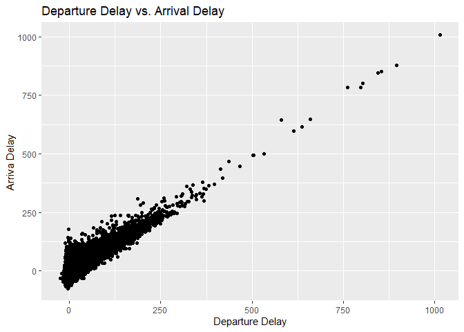

Homework 4
================

# Calculating the Sum of Two Variables

Here we will calculate the sum of two variables.

``` r
library(tidyverse)

#assigning values to variables and printing the sum
a <- 3
b <- 2
a + b
```

    ## [1] 5

``` r
#using the sum function to calculate the sum of the two assigned variables
sum(a, b)
```

    ## [1] 5

# American Airlines Departure Delay vs. Arrival Delay Plot

``` r
library(tidyverse)
library(dplyr)
library(nycflights13)

#This filters the American Airlines flights and assigns it to "AA_flights"
AA_flights <- filter(flights, carrier == "AA")

ggplot(data = AA_flights) +
  geom_point(mapping = aes(x = dep_delay, y = arr_delay)) +
  labs(title = "Departure Delay vs. Arrival Delay", x = "Departure Delay", y = "Arriva Delay")
```

    ## Warning: Removed 782 rows containing missing values (geom_point).

<!-- -->
