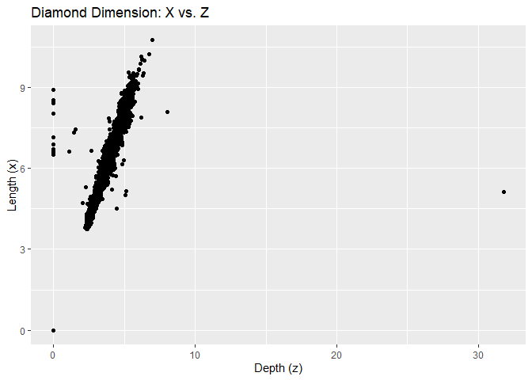

Homework 5
================

We first want to load in the packages and look at the dataset for
diamonds.

``` r
library(tidyverse)
library(dplyr)
```

# Group Data and show the count

``` r
diamonds %>%
  group_by(cut) %>%
  count()
```

    ## # A tibble: 5 x 2
    ## # Groups:   cut [5]
    ##   cut           n
    ##   <ord>     <int>
    ## 1 Fair       1610
    ## 2 Good       4906
    ## 3 Very Good 12082
    ## 4 Premium   13791
    ## 5 Ideal     21551

# Get a random subset of data

``` r
# this creates a random subset of data and condenses it to 1%
condensed_diamonds <- sample_frac(diamonds, 0.01) 
# view the condensed data
print(condensed_diamonds)
```

    ## # A tibble: 539 x 10
    ##    carat cut       color clarity depth table price     x     y     z
    ##    <dbl> <ord>     <ord> <ord>   <dbl> <dbl> <int> <dbl> <dbl> <dbl>
    ##  1  1    Very Good F     SI1      61.8    58  5058  6.37  6.44  3.96
    ##  2  0.9  Very Good G     SI2      64.2    56  3123  6.04  6.11  3.9 
    ##  3  0.3  Ideal     G     VVS1     61.4    56   945  4.34  4.32  2.66
    ##  4  1.07 Very Good H     VS1      62.5    56  6262  6.52  6.55  4.08
    ##  5  0.29 Premium   I     VS2      62.4    58   334  4.2   4.23  2.63
    ##  6  0.4  Premium   G     VVS2     62.7    59  1050  4.72  4.69  2.95
    ##  7  0.31 Ideal     F     VS2      61.9    55   802  4.35  4.31  2.68
    ##  8  0.73 Very Good F     VS1      61.8    59  2843  5.73  5.79  3.56
    ##  9  0.59 Ideal     F     VS2      62.9    55  1743  5.39  5.32  3.37
    ## 10  0.43 Ideal     G     SI1      61.7    55   818  4.89  4.87  3.01
    ## # ... with 529 more rows

# Calculating the average size of 100 largest diamonds

``` r
# check to make sure we have 100 in each clarity
condensed_diamonds %>%
  group_by(clarity) %>%
  count()
```

    ## # A tibble: 8 x 2
    ## # Groups:   clarity [8]
    ##   clarity     n
    ##   <ord>   <int>
    ## 1 I1          8
    ## 2 SI2       105
    ## 3 SI1       125
    ## 4 VS2       115
    ## 5 VS1        89
    ## 6 VVS2       50
    ## 7 VVS1       30
    ## 8 IF         17

Since the condensed subset of data does not have 100 diamonds in each
category, we will use the original data.

``` r
diamonds %>%
  group_by(clarity) %>%
  count()
```

    ## # A tibble: 8 x 2
    ## # Groups:   clarity [8]
    ##   clarity     n
    ##   <ord>   <int>
    ## 1 I1        741
    ## 2 SI2      9194
    ## 3 SI1     13065
    ## 4 VS2     12258
    ## 5 VS1      8171
    ## 6 VVS2     5066
    ## 7 VVS1     3655
    ## 8 IF       1790

We now have the amount of data needed to proceed. We will now calculate
the average size of the 100 largest diamonds in each category. Before
calculating the average size, we must first get the data for each
clarity.

``` r
# create new data set for 100 largest diamonds in each category
large_diamonds <- diamonds %>% 
  # we first want to arrange the diamonds data in order from highest to lowest
  arrange(desc(carat)) %>%
  # now that is has been sorted, we can then group them by clarity
  group_by(clarity) %>%
  # we then only want 100 sizes so we slice them out
  slice(1:100)
# print out the new data
large_diamonds 
```

    ## # A tibble: 800 x 10
    ## # Groups:   clarity [8]
    ##    carat cut       color clarity depth table price     x     y     z
    ##    <dbl> <ord>     <ord> <ord>   <dbl> <dbl> <int> <dbl> <dbl> <dbl>
    ##  1  5.01 Fair      J     I1       65.5    59 18018 10.7  10.5   6.98
    ##  2  4.5  Fair      J     I1       65.8    58 18531 10.2  10.2   6.72
    ##  3  4.13 Fair      H     I1       64.8    61 17329 10     9.85  6.43
    ##  4  4.01 Premium   I     I1       61      61 15223 10.1  10.1   6.17
    ##  5  4.01 Premium   J     I1       62.5    62 15223 10.0   9.94  6.24
    ##  6  4    Very Good I     I1       63.3    58 15984 10.0   9.94  6.31
    ##  7  3.67 Premium   I     I1       62.4    56 16193  9.86  9.81  6.13
    ##  8  3.65 Fair      H     I1       67.1    53 11668  9.53  9.48  6.38
    ##  9  3.5  Ideal     H     I1       62.8    57 12587  9.65  9.59  6.03
    ## 10  3.4  Fair      D     I1       66.8    52 15964  9.42  9.34  6.27
    ## # ... with 790 more rows

Now that we have the new dataset, we can calculate the average size in
each category

``` r
large_diamonds %>%
  # we need to group them so that we can calculate the average for each category
  group_by(clarity) %>%
  # now that they are grouped, we can calculate the average of each
  summarise(average.size = mean(carat, na.rm = TRUE))
```

    ## # A tibble: 8 x 2
    ##   clarity average.size
    ##   <ord>          <dbl>
    ## 1 I1              2.51
    ## 2 SI2             2.62
    ## 3 SI1             2.30
    ## 4 VS2             2.23
    ## 5 VS1             2.10
    ## 6 VVS2            1.66
    ## 7 VVS1            1.51
    ## 8 IF              1.40

# Make two scatter plots

## Plot 1: X vs Y

We first need to make a scatter plot that contains the x vs z dimension
of the diamonds data set.

``` r
ggplot(diamonds) +
  geom_point(mapping = aes(x = y, y = x)) +
  labs(title = "Diamond Dimension: X vs. Y", x = "Width (y)", y = "Length (x)")
```

<!-- -->

We can see from the plot that there is a few outliers that we need to
get rid of in order to make a better plot.

``` r
# this filters out the outliers within this dataset
x_y_diamonds <- diamonds %>%
  filter(x > 3 & y < 20)
ggplot(x_y_diamonds) +
  geom_point(mapping = aes(x = y, y = x)) +
  labs(title = "Diamond dimensions: X vs Y", x = "Width (y)", y = "Length (x)")
```

<!-- -->

## Plot 2: X vs Z

We now need to make a plot of X vs Z.

``` r
ggplot(diamonds) +
  geom_point(mapping = aes(x = z, y = x)) +
  labs(title = "Diamond Dimension: X vs. Z", x = "Depth (z)", y = "Length (x)")
```

<!-- -->

We run into the same problem as before so we must filter out the
outliers

``` r
x_z_diamonds <- diamonds %>%
  filter(x > 3 & z < 10 & z > 1)
ggplot(x_z_diamonds) +
  geom_point(mapping = aes(x = z, y = x)) +
  labs(title = "Diamond dimensions: X vs Z", x = "Depth (z)", y = "Length (x)")
```

<!-- -->
