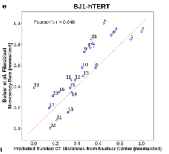
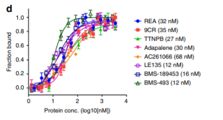

# Good Plot

This is an example of a good plot. This plot shows the correlation between predicted tuned CT distance from BJ1-hTERT Hi-C data and fibroblast microscopy imaging data. The data named "Predicted tuned CT distances from nuclear center" is mapped to the x-axis. The data named "microscopy data" is mapped to the y-axis. Both of these are continuous and the scale transformation is linear

# Bad Plot
 

This is an example of a bad plot. The data "protein concentration" is mapped to the x-axis as well as color, and the data "fraction bound" is mapped to the y-axis. Both of these are continuous. The data mapped on the x-axis is logarithmic.  
There really isn't anything that is considered wrong by Wilke's definition because there are no problems related to mathematics and the plot is not objectively wrong. The plot is bad because it is very hard to differentiate between the differing protein concentrations. It is comparing too many trendlines at once which makes it very difficult to distinguish between them. One way to improve this would be to only compare a couple of them at time instead of all at once.
