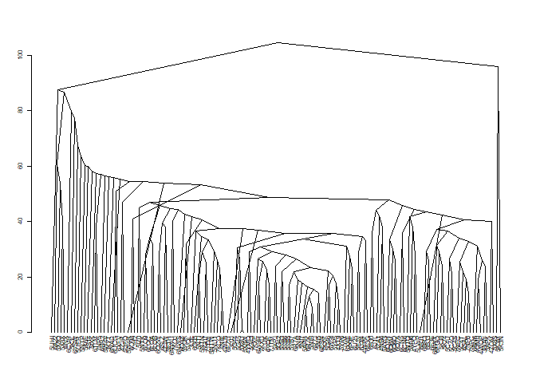
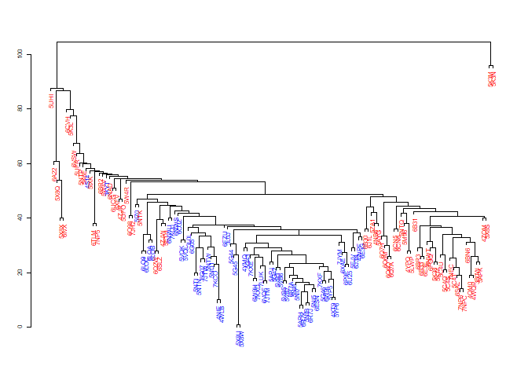

Homework 7
================

Before plotting the bad and good plots, I must first introduce the data
and what it is meant to represent. This project has to do with the
nuclear receptor ROR-gamma. This receptor senses chemical signals and
responds at regulating gene transcription levels. Since ROR-gamma has a
high basal level activity and plays an important role in immune
response, the inhibitor for this receptor is the focus of this study.
For this project, we studied 136 existing ROR-gamma structures with
different ligands bound and reported the features of protein-ligand
interaction patterns and differences between agonist and inverse agonist
binding.  
There are 3 files needed to produce this dendrogram. The first is the
“distance\_N10.txt” file. This file represents the contact interaction
matrices. A distance (dissimilarity score) between two confomartions
measured by the similarity between the corresponding contact matrices is
calculated. This contact-based similarity measurement provides a simple
way of grouping similar conformations. Next is a file called
“names.dat.” This file contains the list of 136 PDB IDs that were used
in this research project. Finally, the last file is “colors.dat.” This
file contains the read list of colors for the PDBs. The two colors used
were red and blue which represent an inverse agonist and agonist,
respectively.

# Bad Plot

``` r
# load needed libraries
library(tidyverse)
library(ggdendro)
library(reshape2)
library(dendextend)

# read tab formatted data file
data <- read.csv("distance_N10.txt", sep = ' ', header = FALSE)
# convert data to matrix format
regularMatrix <- acast(data, V1 ~ V2, value.var = "V3")
# read list of pdb IDs
namelist <- readLines("names.dat")
# convert to distance matrix format for hclust function
distdata <- as.dist(regularMatrix)
# attach pdb IDs to data
labels(distdata) <- namelist
# create dendrogram
clusters <- as.dendrogram(hclust(distdata, method = 'average'))
# set label size for plot
par(cex = 0.5)
# plot basic dendrogram, hang allows labels to be displayed at diferent heights
plot(clusters, type = 'triangle')
```

<!-- -->

This is an example of a bad plot. Firstly, this dendrogram is not
aesthetically pleasing. According to Wilke Section 1, data visualization
should be aesthetically pleasing and good visual presentations enhance
the message of visualization. One way to enhance this dendrogram would
be to remove the triangle-shaped branches and instead use a basic hang
dendrogram. You could alter the hang on the dendrogram so that the PDB
IDs are not all lying next to each other. Also, the PDB IDs themselves
are very hard to read. They all lie on the x-axis and it makes it very
hard to distinguish between them. Also, the agonists and inverse
agonists are not colored which is essential for this plot. According to
Wilke section 4.1, color is used as a means to distinguish discrete
items or groups. The agonists and inverse agonists are the two distinct
groups which need to be distinguished within this dendrogram.

# Good Plot

``` r
# load needed libraries
library(tidyverse)
library(ggdendro)
library(reshape2)
library(dendextend)

# read tab formatted data file
data <- read.csv("distance_N10.txt", sep = ' ', header = FALSE)
# convert data to matrix format
regularMatrix <- acast(data, V1 ~ V2, value.var = "V3")
# read list of pdb IDs
namelist <- readLines("names.dat")
# read list of colors (agonist = blue, inverse agonist = red)
ligcolor <- readLines("colors.dat")
# convert to distance matrix format for hclust function
distdata <- as.dist(regularMatrix)
# attach pdb IDs to data
labels(distdata) <- namelist
# create dendrogram
clusters <- as.dendrogram(hclust(distdata, method = 'average'))
# order label colors according to dendrogram
lcolor_order <- ligcolor[order.dendrogram(clusters)]
# add labels to dendrogram
labels_colors(clusters) <- lcolor_order
# set label size for plot
par(cex = 0.5)
# plot basic dendrogram, hang allows labels to be displayed at diferent heights
plot(hang.dendrogram(clusters, hang = 0.009))
```

<!-- -->

This is an example of a good (or better) plot. While not perfect, it is
easier to read than the above plot. The different PDBs are
distinguishable. Also the inverse agonists and agonists are seperatad by
color which makes it easier to distinguish between the two.
