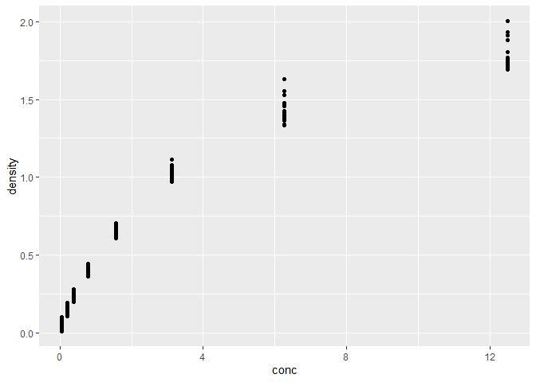
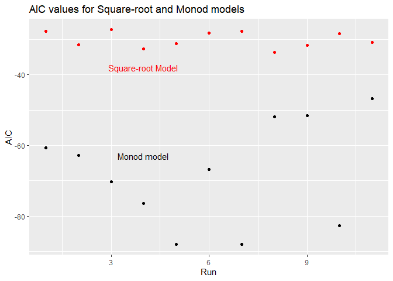

Homework 8
================

# Question 1

Making a data frame that shows the slope of the relationship of price as
a function of weight for each unique color, in decreasing order of
slope.

``` r
library(tidyverse)
library(modelr)
library(broom)
library(nls2)

# nest by color
by_price <- diamonds %>%
  group_by(color) %>%
  nest()

#function to create needed linear model
price_model <- function(df) {
  m <- lm(price ~ carat, data = df)
  m
}

by_price <- by_price %>%
  mutate(fit = map(data, price_model))

get_slope <- function(fit_obj) {
  slope <- coef(fit_obj)[2]
  slope
}

by_price <- by_price %>%
  mutate(slope = map_dbl(fit, get_slope))

#arrange tibble by descending order
ordered_price <- by_price %>%
  arrange(desc(slope))

#print out only color and slope of tibble
final_price <- ordered_price[ , c("color", "slope")]
print(final_price)
```

    ## # A tibble: 7 x 2
    ## # Groups:   color [7]
    ##   color slope
    ##   <ord> <dbl>
    ## 1 F     8677.
    ## 2 G     8525.
    ## 3 D     8408.
    ## 4 E     8296.
    ## 5 I     7761.
    ## 6 H     7619.
    ## 7 J     7094.

# Question 2

Plotting density as a function of concentration.

``` r
ggplot(data = DNase) +
  geom_point(mapping = aes(x = conc, y = density))
```

<!-- -->

## Nest data and getting data

``` r
dna_run <- DNase %>%
  group_by(Run) %>%
  nest()

# create the functions for the two models
sq.mod <- function(df) {
  nls2(formula(density ~ beta_1 *sqrt(conc) + beta_0),
       data = df,
       start = list(beta_1 = 0.5, beta_0 = 0.1))
}

monod.mod <- function(df) {
  nls2(formula(density ~ (conc * beta_1)/(conc + beta_0)),
       data = df,
       start = list(beta_1 = 2, beta_0 = 0.5))
}

sqrt_model <- map(dna_run$data, sq.mod)
monod_model <- map(dna_run$data, monod.mod)

# add to the data frame
dna_run <- dna_run %>%
  mutate(sqrt.model = map(data, sq.mod),
         monod.model = map(data, monod.mod))

# get the AIC values for each model using glance
run_models <- dna_run %>%
  mutate(glance.sq = map(sqrt.model, broom::glance),
         glance.monod = map(monod.model, broom::glance)) %>%
  unnest(c(glance.sq, glance.monod), .drop = TRUE)
```

    ## Warning: The `.drop` argument of `unnest()` is deprecated as of tidyr 1.0.0.
    ## All list-columns are now preserved.

``` r
final_data <- run_models %>%
  select(Run, AIC, AIC1)
```

## Plot for the AIC values

``` r
ggplot(final_data) +
  geom_point (aes(x = as.integer(Run), y = AIC), color = "red") +
  geom_point(aes(x = as.integer(Run), y = AIC1)) + 
  annotate("text", x = 4, y = -38, label = "Square-root Model", color = "red") +
  annotate("text", x = 4, y = -63, label = "Monod model") +
  labs(title = "AIC values for Square-root and Monod models", x = "Run", y = "AIC")
```

<!-- -->

## Best Model

The model with the lowest AIC value is usually considered the best
model. As we can see from the plot, the monod model produces the most
negative values which means that is has a better fit
